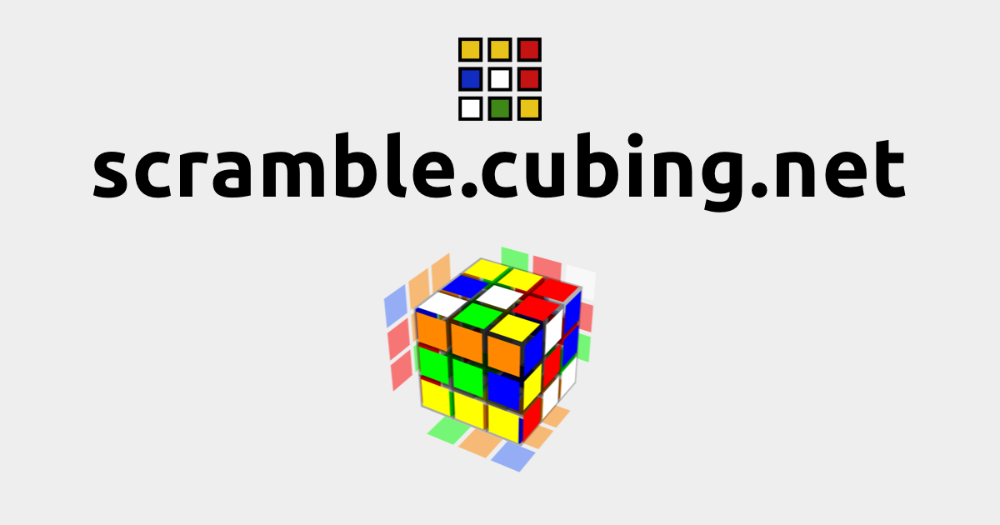

# [`scramble.cubing.net`](https://scramble.cubing.net/)

A simple way to get a scramble. Useful for demos where you want a slick way to generate and show a random scrambles.

Scrambles are generated using [`cubing.js`](https://github.com/cubing/cubing.js/). They are random-state, except scramble filtering is not yet implemented for all puzzles (it will be in the future).

## Usage

Visit <https://scramble.cubing.net/> and go!

- To change events, click on the current event icon and select a new event.
- To generate a new scramble, refresh the page.
  - If you have a keyboard connected, you can also press the space key.
  - If you're running in "standalone" mode (i.e. "Add to Home Screen" for iOS Safari or Android Chrome"), there should be a scramble refresh icon in the lower right of the page.

To use like a desktop app, use Chrome and: click on the three-dot settings button (`⋮`) → More Tools → Create Shortcut → Check "Open as window" → Create.
